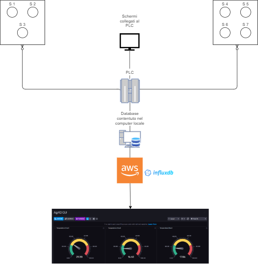
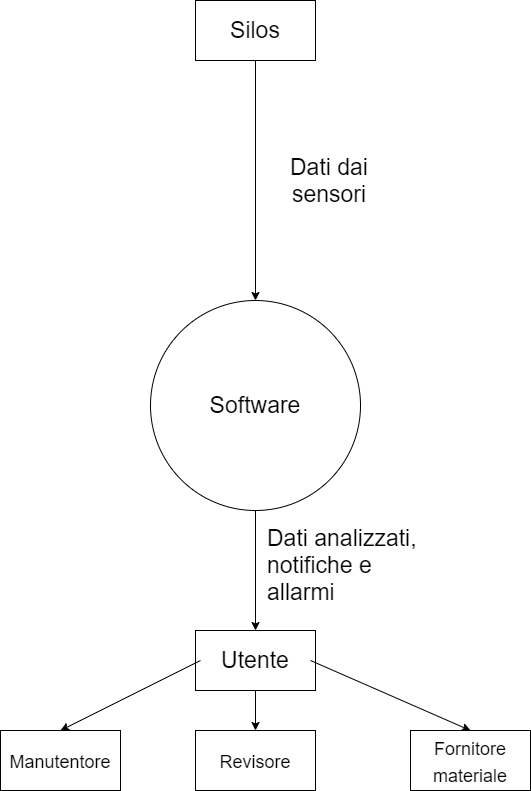
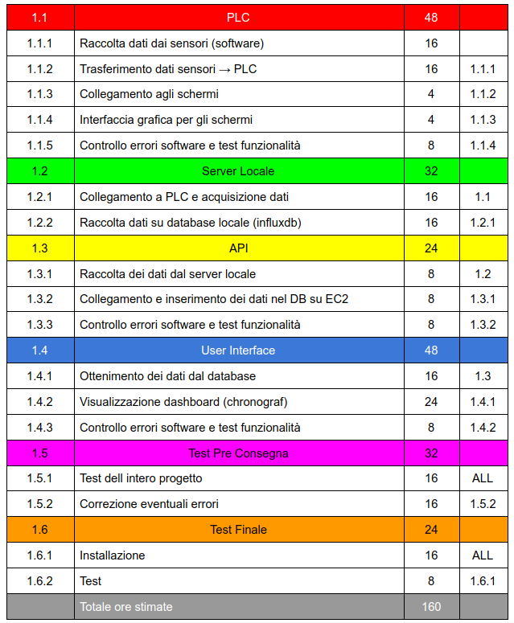
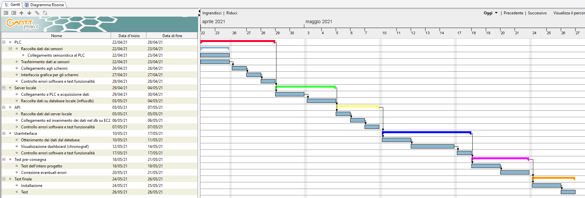
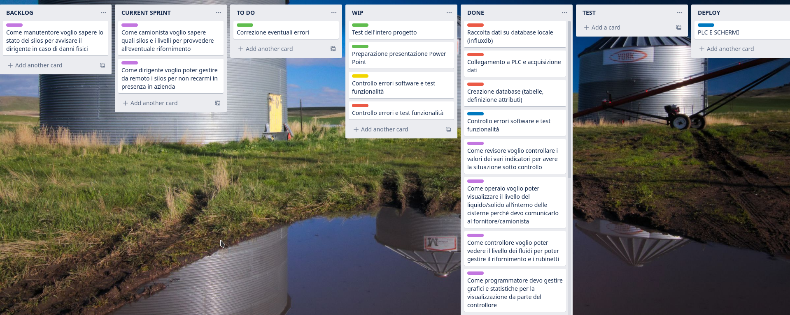
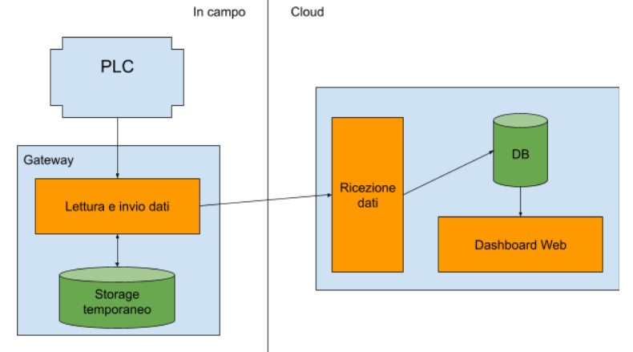

# Project Work DIQU

### Group 4: AgriDIQU

**Members:**

- [Erik Drozina](https://github.com/erikdrozina)
- [Marika Fontana](https://github.com/MarikaFontana36)
- [Francesco Sartori](https://github.com/Francesco2501)

### **Files**

All the files can be found in the [Github repo](https://github.com/erikdrozina/ITS-Kennedy-Projects/tree/master/ProjectWork) or in the release section ready to use.

### **Introduction**

Design and implementation of software to monitor the level of the content of 7 silos in an industrial plant in North Dakota.

The silos are grouped in 2 blocks (one contains 3 and the other 4 silos) in two areas located 150 meters from each others.

Each silo has 8 sensors to monitor the content level and a temperature and humidity sensor outside to monitor the outside environment.
All the sensors are connected to a PLC that compute and elaborate all the data.

A local server takes all the necessary data from the PLC and send them to a server in the cloud where they are displayed in real time.

## **Initial brainstorming**

In our initial brainstorming, we gathered as much information as possible about the client situation and we wrote a [quote](https://docs.google.com/document/d/1KFkHjfYeW-Sfa_ytyjblEQrI2LBM1ptnCbwFwMFPR2o/edit?usp=sharing) and a detailed overview and description of the project that can be found on [Drive](https://docs.google.com/document/d/1fkmiSBm4CSdgFqRkSN6lpyPtMEcRqfq6pHE84sshr5w/edit?usp=sharing)

During this phase we created some diagram to better understand the project that can be found below.

### **Overview**

### **System Context Diagram**

## **Project Plannning**

After the initial draft we focused on planning the whole project and more specifically we broke down the project into small tasks creating a Work Breakdown Structure specifying if a task will depend on another task.

### **Work Breakdown Structure**

The WBS helped us to create the Gantt Diagram to better visualize the project over time.

### **Gantt Diagram**

## **Agile Method**

After using the traditional method to set up our project we tried to use the Agile method, a different type of project management process where demands and solutions evolve through the collaborative effort of self-organizing and cross-functional teams and their customers.

To embrace the Agile methodology we used and created our user stories, short text written with the user experience in mind.

An example could be: _As a controller I want to see the level of the content inside the silo to manage the refueling and the valves._

Or: _As a manager I want to manage all the silos remotely because I don't want to be there physically_

### **Trello**

At the end we created a Trello kanban to manage and visualize all the tasks we needed to do to complete the project.

## **General Overview**

After the initial brainstorming phase this is the result that represents how each component of this project communicate with each other.

Let's start with the PLC!

## **PLC**

For the PLC we worked on Simatic Manger S7 for the PLC logic and then with WinCC Flexible for the connection and the graphical environment.

The first step was to simulate the PLC envirimageonment because we weren't able to test the project on a physical PLC.
Then the object was to recreate all the logic in different blocks using languages like AWL and KOP.

As said in the introduction each silo has 8 senors for the level of the content and outside it has 2 sensors: one for the temperature and one for the humidity. Then it has 2 valves: one that insert the liquid/solid and one that remove what's inside.

We thought to block the insertion of the content when the highest sensor was triggered and to block the discharge when the first sensor is no longer triggered by the content inside.
In this case is not possible to empty the silo so we added a second button that allows to discharge all the content that's inside so the silo can be easily emptied from its content and filled with another material.

For a better estimate of the content's level we calculated the volume and its mass through a selection of materials.

If a worker would like to have an easy to read overview there is a page where you can easily see all the silos and their level, the content inside and to operate on the silo you can just click the one desired in the overview.

Then in the "More Info" page there is a more detailed overview with the status of each silo, their content and a graph that shows the variation of the content's level inside each silo.

More languages are available just by ressing the top right button and the software will cycle to English, Italian, Spanish, German and French.

## **Cloud**

For the cloud part we have created an EC2 instance by connecting it to our security group to control both incoming and outgoing traffic